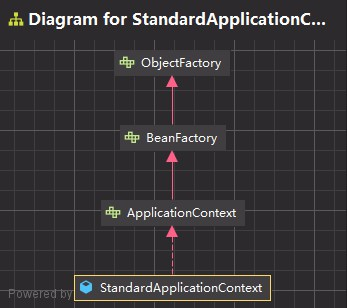

# `ioc-php`

> the poor `IOC ` container for `php ` language.

## 0.`IOC` 容器能力

- 1.向 `IOC` 注册 `bean`;
- 2.向 `IOC` 获取 `bean`;
- 3.销毁 `IOC` 容器中已注册的 `bean`;
- 4.刷新 已经注册 `IOC` 容器的`bean` 的属性·

### 0.1.标准 `IOC` 容器



### 0.2.生命周期 `IOC` 容器


## 1.创建 `IOC` 容器

> ```php
> class Student
> {
>  public $name = 'Adam';
>  public $age = 18;
> }
> 
> class Grade
> {
>  public $name = 'Grade1';
>  public $level = 2;
> }
> 
> class Man
> {
>     public $name = 'SuperMan';
>     public $age = 18;
> }
> 
> class Group
> {
>  public function doSomething()
>  {
>      echo __CLASS__ . ":" . 'sayHello' . "\n";
>  }
> }
> 
> class Department
> {
>  private $group;
> 
>  public function __construct(Group $group)
>  {
>      $this->group = $group;
>  }
> 
>  public function doSomething()
>  {
>      $this->group->doSomething();
>      echo __CLASS__ . ":" . 'sayHello' . "\n";
>  }
> }
> 
> class Company
> {
>  private $department;
> 
>  public function __construct(Department $department)
>  {
>      $this->department = $department;
>  }
> 
>  public function doSomething()
>  {
>      $this->department->doSomething();
>      echo __CLASS__ . ":" . 'sayHello' . "\n";
>  }
> }
> ```
>
>

```php
// 创建一个 标准的 {@code IOC} 容器
$applicationContext = new StandardApplicationContext();

// 创建一个 具有简单生命周期管理的 {@code IOC} 容器
$applicationContext = new LifecycleApplicationContext();
```

## 2.向 `IOC` 容器注册 `bean`

```php
// 创建一个 标准的 {@code IOC} 容器
$applicationContext = new StandardApplicationContext();

// 向 {@code IOC} 容器中注册 {@code bean}
// 1.1.手动实例化 {@code bean} 并注册
$student = new Student();
$applicationContext->register('student', $student);

// 1.2.容器自动实例化 {@code bean} 并注册
$applicationContext->registerz(Grade::class);
```

## 3.向 `IOC` 容器获取 `bean`

```php
// 创建一个 标准的 {@code IOC} 容器
$applicationContext = new StandardApplicationContext();

$student = new Student();
$applicationContext->register('student', $student);

$st = $applicationContext->getBean('student');
$this->assertNotNull($st,'the bean retrieve from ioc can\'t be null');;
$this->assertEquals('Adam', $st->name);

$applicationContext->registerz(Grade::class);
$gd = $applicationContext->getBeanz(Grade::class);
$this->assertNotNull($gd, sprintf('the bean:%s retrieve from ioc can\'t be null', Grade::class));
$this->assertEquals('Grade1', $gd->name);
```

## 4.依赖注入

```php
$applicationContext = new StandardApplicationContext();
// 通过 类名 获取 {@code IOC} 已注册的实例
// 通过构造函数的 类名 - 自动向 {@code IOC} 容器 获取对应的依赖-并注入到对应的属性中
$applicationContext->registerz(Department::class);

$department = $applicationContext->getBeanz(Department::class);
$department->doSomething();

$group = $applicationContext->getBeanz(Group::class);
$group->doSomething();
$this->assertEquals(1, 1);
-- - print
ioc\Group:sayHello
ioc\Department:sayHello
ioc\Group:sayHello
```

## 5.从`IOC`销毁 `bean`

```php
// 创建容器
$applicationContext = new LifecycleApplicationContext();
$applicationContext->registerz(Person::class);
$person = $applicationContext->getBeanz(Person::class);
$this->assertNotNull($person);

// 销毁 {@code bean}
$destroyz = $applicationContext->destroyz(Person::class);
$this->assertTrue($destroyz);
// 再次获取 -> NULL
$personNull = $applicationContext->getBeanz(Person::class, true);
$this->assertNull($personNull);
```

## 6.刷新`IOC` 容器 `bean` 属性

### 6.1.正常刷新

```php
$applicationContext = new LifecycleApplicationContext();
$applicationContext->registerz(Person::class);
$person = $applicationContext->getBeanz(Person::class);
$this->assertNotNull($person);
$this->assertEquals('Adam', $person->name);

$refreshPropertiesz = $applicationContext->refreshPropertiesz(Person::class, 'name', 'Sharkchili');
$this->assertTrue($refreshPropertiesz);

$personRefreshed = $applicationContext->getBeanz(Person::class);
$this->assertNotNull($personRefreshed);
$this->assertEquals('Sharkchili', $personRefreshed->name);
```

### 6.2.`bean` 未注册 `IOC`

```php
$applicationContext = new LifecycleApplicationContext();
$applicationContext->registerz(Person::class);
$person = $applicationContext->getBeanz(Person::class);
$this->assertNotNull($person);
$this->assertEquals('Adam', $person->name);

$refreshPropertiesz = $applicationContext->refreshPropertiesz(Man::class, 'name', 'Sharkchili');
$this->assertFalse($refreshPropertiesz);
```

### 6.3.`bean` 没有对应的属性

```php
$applicationContext = new LifecycleApplicationContext();
$applicationContext->registerz(Man::class);
$refreshPropertiesz = $applicationContext->refreshPropertiesz(Man::class, 'province', 'Chongqing, Chain');
$this->assertFalse($refreshPropertiesz);
```

## 7.单元测试

```php
// tests/ioc/xxx.php
```

## 8.`RoadMap`

- 1.抽取 `bean` 实现的接口列表,并添加映射;
- 2.抽取 `bean` 继承的父类列表,并添加映射;
- 3.实现通过父类(接口类) 获取子类实例列表或者通过父类(接口类)申明而实现列表注入;
- 4.实现 `beandefinition` 实例;
- 5.实现 `XML` 配置,自动实例话 bean 并注册到 `IOC` 容器;
  - 类似于 `Spring`(`Java`) 的 `applicationContext.xml`
- 6.实现注释注解的自动配置
  - 类似于 `Spring Boot` (`Java`) 的 `@EnableAutoConfiguration`